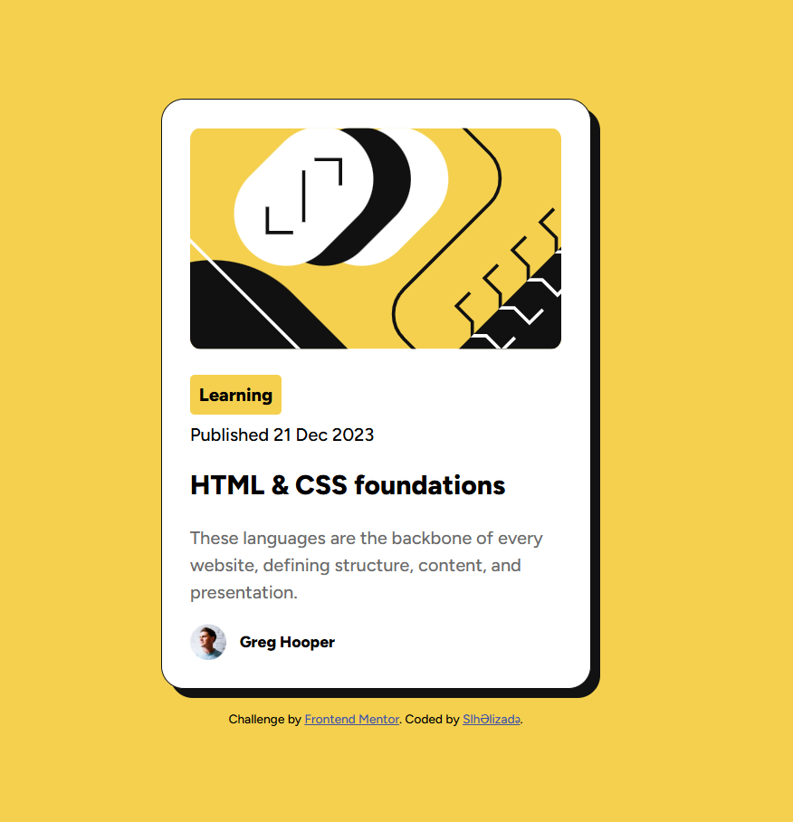

# Frontend Mentor - Blog preview card

## Welcome! 👋

# Frontend Mentor - Blog Preview Card Solution

Bu mənim [Frontend Mentor](https://www.frontendmentor.io/) üzərindəki Blog Preview Card challenge çözümüm.

## İçindekiler
- [Genel Bakış](#genel-bakış)
  - [Ekran Görüntüsü](#ekran-görüntüsü)
  - [Bağlantılar](#bağlantılar)
- [Süreç](#süreç)
  - [Kullanılan Teknolojiler](#kullanılan-teknolojiler)
  - [Neler Öğrendim](#neler-öğrendim)
- [Yazar](#yazar)

## Genel Bakış
Bu projedə Frontendmentorio saytından götürdüyüm Newbie səviyəsində bir web səhifəsi kodladım.

### Ekran Görüntüsü

### Bağlantılar
- Çözüm URL'si: [GitHub Reposu](https://github.com/Salih-Alizade/Blog-Preview-Card-kodlama-denemem)
- Canlı Site URL'si: https://github.com/Salih-Alizade

## Süreç
Öncəliklər Frontedmentor saytından tasklar hakkında zip dosyalarını indirdim. Sonra içlərinidə bəzi bilgiləri seçib(şəkil, asser və desgin qovluqları, style-guide.md, README.md, index.html) yarattığım qovluq içərisə daxil ettim. Bu qovluq içərisində index.html adını dəyişdim, css dosyası oluşturdum. Html kodlarını ilkin olaraq qutulara ayırdım, sonra css də kodlamaya çalıştım. İlkin olarak arxa plan rəngi verdim, body qismini mərkəzə gətirdim. Sonra card qismini kodladım, bu şəkildə irəliləyək teglərə, classlar oluşduraraq yazılara dizayn uyguladım. Ən sonda saytımın telefonda da yaxşı görüntü uyumunu əldə edilməsi üçün media query yazdım.

### Kullanılan Teknolojiler
- Semantic HTML5 markup
- CSS custom properties
- Flexbox
- Desktop-first workflow

### Neler Öğrendim
Web Programla FF indən əvvəl əlimi isitmək və bir az mövzuları təkrar etmək üçün bu projeyi ettim. Bir neçə bilgi öyrəndim və tətbiqlərini ettim. Bu proje sırasında Google Fonts kullanımını, Flexbox ile kartı ekranın ortasına yerleştirmeyi ve responsive (duyarlı) tasarım için media queries kullanmayı pekiştirdim. Özellikle dosya yollarının (assets/fonts) yönetimi konusunda təcrübə qazandım.

## Yazar
- Frontend Mentor - [@Salih-Alizade](https://www.frontendmentor.io/profile/Salih-Alizade)
- GitHub - [Salih-Alizade](https://github.com/Salih-Alizade)
